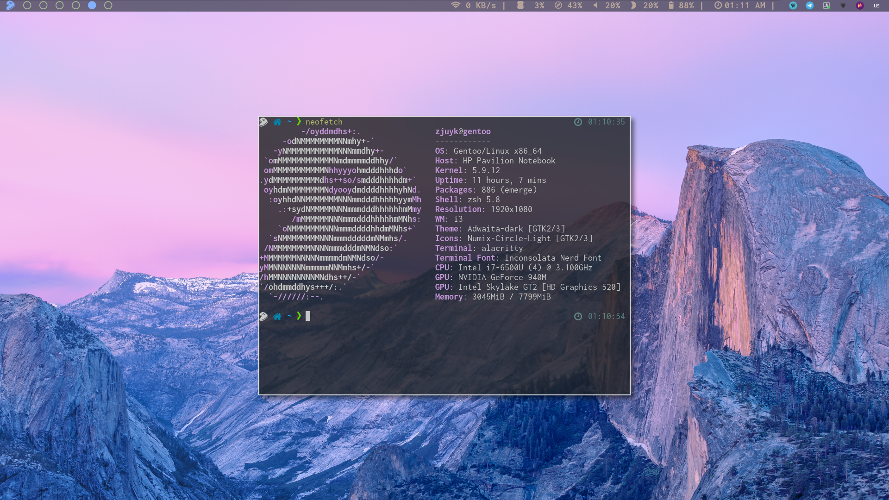
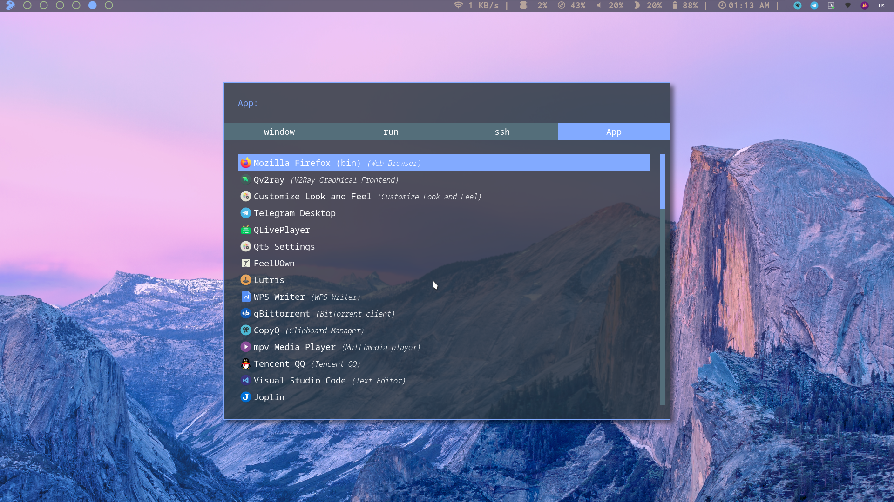
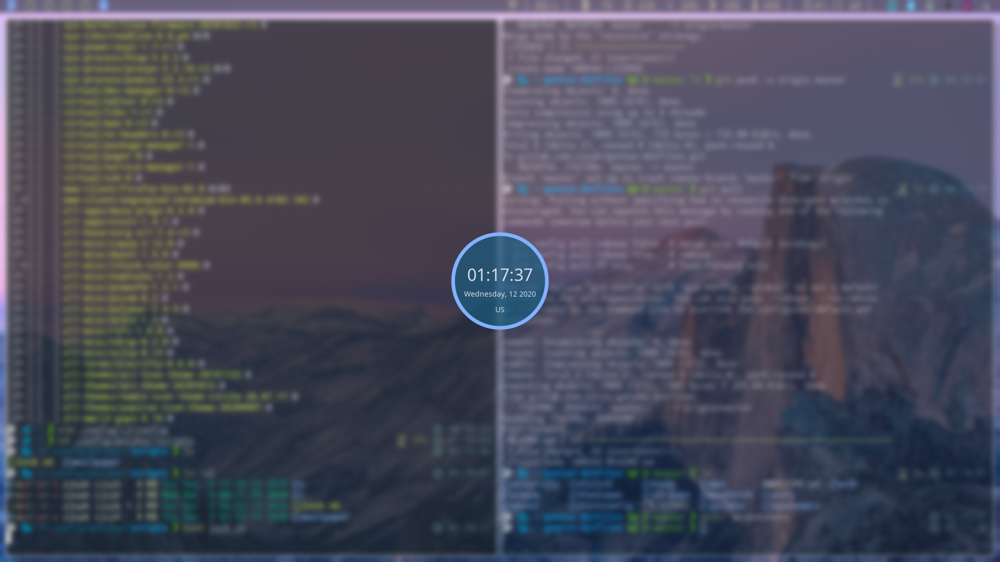
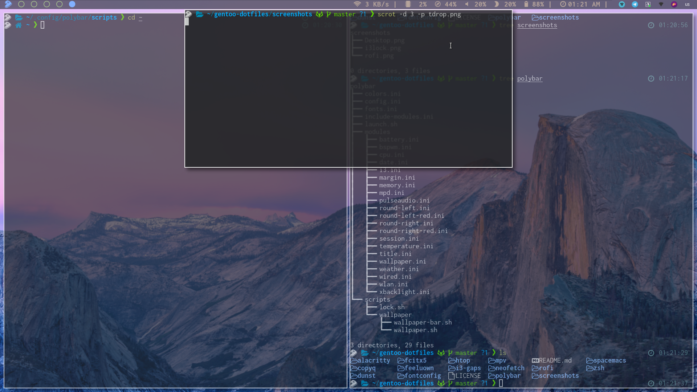

# screenshot

## application list
- GTK theme: adwaita dark
- QT theme: follow the GTK theme by setting `export QT_STYLE_OVERIDE=GTK+` to .xprofile
- Icon theme: Arc icon theme, numix circle icon theme, papirus icon theme
- Terminal: alacritty
- Message notifier: dunst
- Editor: emacs and vscode-bin
- System Monitor: htop
- System information: neofetch
- Panel bar: polybar
- Program Finder: rofi
- Audio Controler: pulseaduio
- Small keyboard controller: numlockx
- Vedio player: mpv
- Browser: firefox-bin
- Proxy: qv2ray
- Im: telegram-desktop-bin
- Music player: feeluown
- Game: lutris and steam
- Clipboard Manager: copyq
- Note: Joplin
- Bittorrent client: qbittorrent
- File Manager: pcmanfm
- Input Method: fcitx5 pinyin
- Document: wps
- Online vedio: qliveplayer
- Screen cut: scrot and flameshot
- Phone connector: scrcpy
- Translate tool: ydcv-rs
- Screen shoot: peek
- Compositor: picom
- Lock: i3loc-color
- Wallpaper Manager: feh
- Font: Inconsolata, Inconsolata Nerd Font, Font Awesome, Iosevka Nerd Font, Jetbrains Mono Nerd Font, Noto Fonts, Noto Fonts CJK, Noto emoji
- Shell: zsh with powerlevel10k theme

## Addition tools
- lsd
- duf
- bat
- tdrop
- xclip
- mlocate
- lm-sensors
- ripgrep
- proxychains
- tree

## gentoo tools
- gentoolkit
- layman
- eix
- gentoo-kernel-bin
